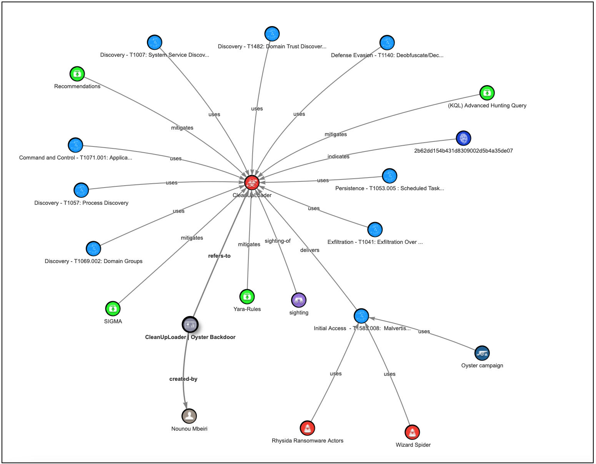

# CleanUpLoader | Oyster Backdoor 

# Summary:

CleanUpLoader, also known as Oyster or Broomstick, is a sophisticated backdoor malware written in C++, first identified in July 2023 by IBM researchers. This malware is typically delivered through fake software installers, such as those for Microsoft Teams or Google Chrome.

The malware leverages legitimate digital certificates issued to organizations like Shanxi Yanghua Furnishings and Shantou Chenghai Rongsheng to bypass security measures, presenting itself as a trusted application during the initial infection phase.

Once installed, CleanUpLoader establishes communication with command-and-control (C2) servers via HTTPS, using HTTP POST requests to specific endpoints like `/api/connectivity`, `/api/session`, and `/api/connect`, allowing attackers to maintain persistence, gather information, and exfiltrate data. 

## Attribution & Threat Actor
- Rhysida
- Wizard Spider

## Diagram Overview of Attack/Methods STIX2: 

[STIX Visualizer](https://oasis-open.github.io/cti-stix-visualization/?url=https://raw.githubusercontent.com/CTI-Driven/Advanced-Threat-Hunting-Ransomware-Groups/main/Arsenals/CleanUpLoader/STIX/CleanUpLoader.json)

 

## Technical Details:

A true positive detection of the Oyster Backdoor (CleanUpLoader) includes various indicators and behaviors indicative of its presence:

### Persistence Mechanisms:
- **Scheduled Task Creation**:  
  ```bash
  schtasks.exe /create /tn ClearMngs /tr "rundll32 '<location of binary>\CleanUp30.dll', Test" /sc hourly /mo 3 /f
  ```
  Creates a scheduled task to run the malware periodically.

- **Malicious Shortcut Creation**:  
  ```powershell
  powershell.exe -Command "$ws = New-Object -ComObject WScript.Shell; $s = $ws.CreateShortcut('C:\Users\<User>\AppData\Roaming\Microsoft\Windows\Start Menu\Programs\Startup\DiskCleanUp.lnk'); $s.TargetPath = 'C:\Users\<User>\AppData\Local\Temp\CleanUp.dll, Test'; $s.Save()"
  ```
  Creates a shortcut to ensure execution at startup.

### C2 Communication:
The malware communicates via HTTP POST requests to endpoints such as:
- `/api/connectivity`
- `/api/session`
- `/api/connect`

### Network Connections:
The backdoor connects to suspicious domains and IPs, including:
- **Domain**: `supfoundrysettlers[.]us`
- **IP Address**: `195.85.114[.]193` over ports 4288, 4043, and 777.

### Reconnaissance Commands:
CleanUpLoader executes commands like:
- `whoami.exe` (current user)
- `net1 group "domain computers" /domain` (enumerate domain computers)
- `nltest.exe /domain_trusts` (check domain trusts)
- `tasklist.exe` (list running processes)

## Detection Opportunities (KQL):

```kusto
// Replace "Timestamp" with "TimeGenerated" when running this KQL query in Microsoft Sentinel.

//Comment: A true positive would involve the following:
//-> schtasks.exe /create /tn ClearMngs /tr "rundll32 '<location of binary>\CleanUp30.dll',Test" /sc hourly /mo 3 /f
//-> powershell.exe -Command "$ws -New-Object -ComObject WScript.Shell; $s - $ws.CreateShortcut ('C:\Users\<User>\AppData\Roaming\Microsoft\Windows\Start Menu\Programs\Startup\DiskCleanUp.1nk'); $s.TargetPath 'C:\Users\<User>\AppData\Local\Temp\CleanUp.dll, Test'; $s.Save()
//-> HTTP connection established to the domain "supfoundrysettlers[.]us" by the file "CleanUp30.dll,"
//-> //-> C2 connection to the IP address "195.85.114[.]193" over ports 4288, 4043, and 777
//-> HTTP POST requests to /api/connectivity, /api/session, and /api/connect used by CleanUpLoader
//-> Commands intended to gather information on the compromised host and domain environment, such as "whoami.exe," "net1 group 'domain computers' /domain," "nltest.exe /domain_trusts," and "tasklist.exe"
//-> HTTP POST requests to endpoints like /api/connectivity, /api/session, and /api/connect used by CleanUpLoader
//References:
//   - https://www.reliaquest.com/blog/5-malware-variants-you-should-know/
//    - https://go.recordedfuture.com/hubfs/reports/cta-2024-1009.pdf
//    - https://www.rapid7.com/blog/post/2024/06/17/malvertising-campaign-leads-to-execution-of-oyster-backdoor/
//    - https://app.any.run/tasks/aa15e125-38b8-44d8-add9-54e21e6813bb
//
//QKL Advanced hunting query:
let timeframe = 24hr;
// Detection 1: Valid digital certificates used by CleanUpLoader
let ValidDigitalCertificates = (
    DeviceProcessEvents
    | where Timestamp >= ago(timeframe)
    | invoke FileProfile()
    | where Signer has_all ("Shanxi","Yanghua","Furnishings") or Signer has_all ("Shantou","Chenghai","Rongsheng")
);
// Detection 2: C2 HTTP POST requests Linked to CleanUpLoader
let C2HttpPostRequest = (
    DeviceNetworkEvents
    | where Timestamp >= ago(timeframe)
    | where ActionType == "HttpConnectionInspected"
    | extend AdditionalFields_info = parse_json(AdditionalFields)
    | where AdditionalFields_info.method == "POST"
    and AdditionalFields_info.uri in ("/api/connectivity", "/api/session", "/api/connect")
);
// Detection 3: Process commands events Linked to CleanUpLoader
let ProcessCommandsEvents = (
    DeviceProcessEvents
    | where Timestamp >= ago(timeframe)
    | where (  (ProcessCommandLine has_all ("rundll32.exe", "%s", "Test"))
            or (ProcessCommandLine contains "rundll32.exe" and ProcessCommandLine has_any ("CleanUp.dll", "CleanUp30.dll"))
            or (ProcessCommandLine has_all ("schtasks.exe", "/create", "ClearMngs", "rundll32", ".dll", "Test"))
            or (ProcessCommandLine has_all ("powershell.exe", "schtasks.exe", "CreateShortcut", ".lnk", "rundll32", ".dll", "Test"))
        )
);
// Detection 4: File creation events Linked to CleanUpLoader
let FileCreationEvents = (
    DeviceFileEvents
    | where Timestamp >= ago(timeframe)
    | where ActionType == "FileCreated"
    | where FileName in ("CleanUp.dll", "CleanUp30.dll") and FolderPath has_any ("\\Temp\\")
);
// Combine all detections
let Suspicious_OysterBackdoorActivities = (
    union ValidDigitalCertificates, C2HttpPostRequest, ProcessCommandsEvents, FileCreationEvents
    | summarize arg_max(Timestamp, *) by DeviceId
    | order by Timestamp asc
);Suspicious_OysterBackdoorActivities
```

## ATT&CK Techniques:
The Oyster Backdoor (CleanUpLoader) employs a range of techniques from the MITRE ATT&CK framework to conduct its malicious activities. Below is a list of relevant techniques:

1. **Initial Access**
    - **T1583.008 - Malvertising**:  
        Utilizes fake websites that appear to offer legitimate software downloads to trick users into installing the malware.

2. **Execution**
    - **T1059.001 - Command and Scripting Interpreter: PowerShell**:  
        Executes PowerShell commands to create malicious shortcuts and perform other actions.
    - **T1059.003 - Command and Scripting Interpreter: Windows Command Shell**:  
        Uses cmd.exe for executing system commands and scripts.

3. **Persistence**
    - **T1060 - Registry Run Keys / Startup Folder**:  
        Creates startup items or modifies registry entries to ensure persistence.
    - **T1071.001 - Application Layer Protocol: Web Protocols**:  
        Communicates over standard HTTP/S protocols to maintain persistence and evade detection.

4. **Discovery**
    - **T1069.002 - Domain Groups**:  
        Executes commands to gather information about domain groups and relationships.
    - **T1482 - Domain Trust Discovery**:  
        Executes commands to discover domain trust relationships.
    - **T1057 - Process Discovery**:  
        Gathers information about running processes using commands like tasklist.exe.
    - **T1007 - System Service Discovery**:  
        Discovers active system services and configurations through various commands.

5. **Command and Control**
    - **T1071.001 - Application Layer Protocol: Web Protocols**:  
        Establishes C2 communication via standard web protocols, blending in with normal traffic.

6. **Exfiltration**
    - **T1041 - Exfiltration Over C2 Channel**:  
        Exfiltrates sensitive data over the same C2 channel used for communication, making detection difficult.

7. **Defense Evasion**
    - **T1140 - Deobfuscate/Decode Files or Information**:  
        Uses obfuscation techniques to hide its code and evade detection during operation.

## References:
- https://www.reliaquest.com/blog/5-malware-variants-you-should-know/
- https://go.recordedfuture.com/hubfs/reports/cta-2024-1009.pdf
- https://www.rapid7.com/blog/post/2024/06/17/malvertising-campaign-leads-to-execution-of-oyster-backdoor/
- https://app.any.run/tasks/aa15e125-38b8-44d8-add9-54e21e6813bb
