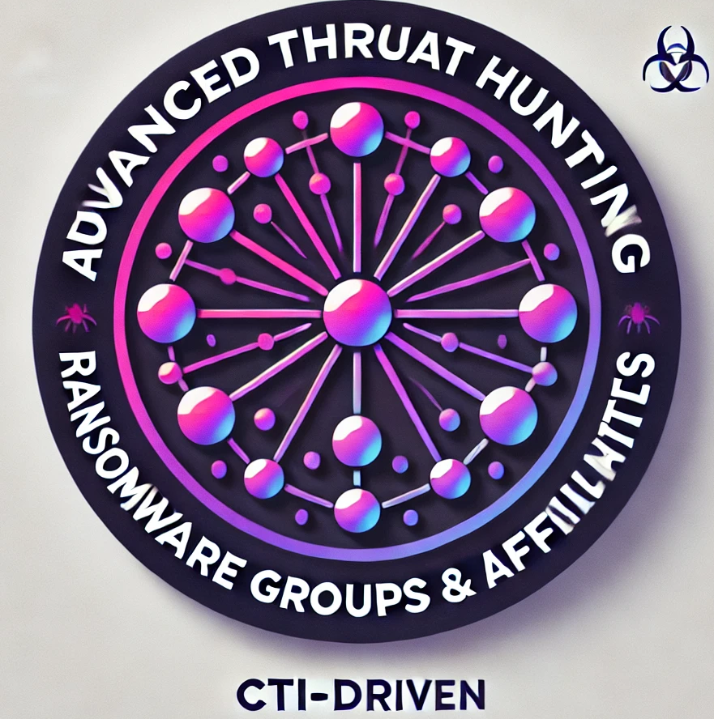

 

# Advanced Threat Hunting: Ransomware Groups & Affiliates

This repository is dedicated to documenting the **arsenals**, **exploited CVEs**, and their associated **TTPs (Tactics, Techniques, and Procedures)** used by ransomware groups and their affiliates, particularly those that are **not widely documented**. The goal of this project is to empower cybersecurity defenders with **actionable intelligence** by providing:

- **STIX format** for easier integration into threat intelligence platforms.
- **Advanced Threat Hunting rules** in **KQL (Kusto Query Language)** and **Sigma rules** whenever applicable.
